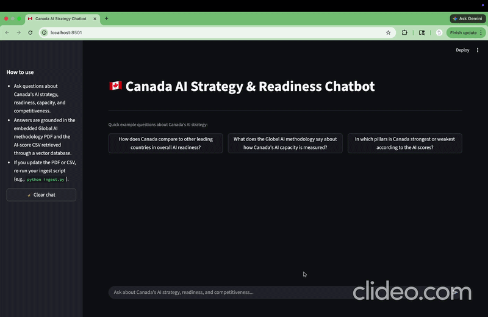
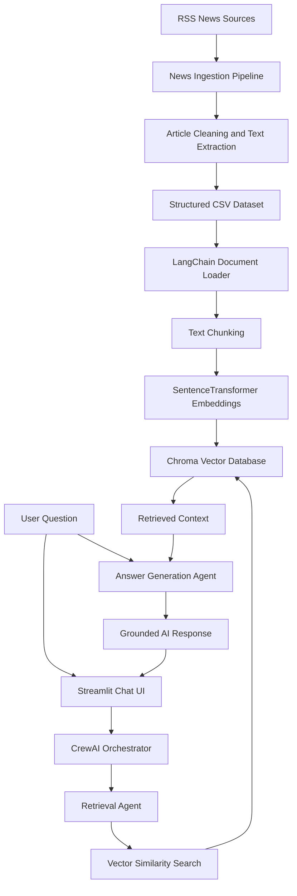

# AI Innovation & Competitiveness Chatbot

### Multi-Agent RAG System for AI Strategy, Innovation, and Industry Intelligence

This project implements a domain-specific AI chatbot that answers questions about **AI innovation, national competitiveness, industry developments, and AI strategy** using a Retrieval-Augmented Generation pipeline and a multi-agent reasoning workflow.

The system combines **news ingestion**, **semantic search**, **vector retrieval**, **CrewAI agent orchestration**, and a **Streamlit chat interface** to provide grounded responses based on real AI-related articles and collected source material.

---

## Project Overview

The chatbot is designed to help users explore questions such as:

* What are the latest trends in AI innovation?
* How is Canada positioned in the global AI ecosystem?
* What companies, countries, and industries are driving AI competitiveness?
* What policy or investment signals appear in recent AI news?
* How do retrieved sources support the generated answer?

Instead of relying only on the language model’s internal knowledge, the system retrieves relevant external context first, then injects that context into the agent workflow before generating the final answer.

## Demo



---

## Key Features

* **Multi-agent workflow with CrewAI**
  Separates information retrieval, evidence organization, and response generation into structured agent tasks.

* **Retrieval-Augmented Generation pipeline**
  Uses LangChain and ChromaDB to retrieve relevant article chunks before answering user questions.

* **SentenceTransformer embeddings**
  Converts news articles and source documents into semantic vector representations for similarity search.

* **Custom news ingestion pipeline**
  Collects AI-related articles from RSS feeds and processes them into structured CSV data.

* **Grounded response generation**
  Injects retrieved context into prompts so the chatbot can answer based on available evidence.

* **Streamlit user interface**
  Provides a simple web-based chat interface for interacting with the RAG system.

* **Reproducible vectorstore creation**
  Allows the vector database to be rebuilt from the collected article dataset.

---

## System Architecture



---

## Technology Stack

| Area                   | Tools                                          |
| ---------------------- | ---------------------------------------------- |
| Language               | Python                                         |
| LLM Orchestration      | CrewAI                                         |
| RAG Framework          | LangChain                                      |
| Embeddings             | SentenceTransformers                           |
| Vector Database        | ChromaDB                                       |
| LLM                    | OpenAI GPT model                               |
| Frontend               | Streamlit                                      |
| Data Processing        | pandas, feedparser, BeautifulSoup, trafilatura |
| Environment Management | python-dotenv                                  |

---

## Project Structure

```text
Group_Project/
├── crew/
│   ├── agents.py          # Defines CrewAI agents
│   ├── tasks.py           # Defines agent tasks and workflow logic
│   ├── tools.py           # Custom retrieval tools for agents
│   ├── llm.py             # LLM configuration
│   ├── main.py            # Backend entry point
│   └── __init__.py
│
├── rag/
│   ├── ingest.py          # Builds the vector database
│   ├── retriever.py       # Retrieves relevant context from Chroma
│   └── __init__.py
│
├── frontend/
│   ├── app.py             # Streamlit chatbot interface
│   └── __init__.py
│
├── news_ingestion/
│   ├── scrape_news.py     # RSS/news collection and processing
│   └── ...
│
├── data/
│   ├── news_articles_*.csv
│   └── vectorstore_news_ai/
│
├── requirements.txt
├── .gitignore
└── README.md
```

---

## How It Works

### 1. News Collection

The system collects AI-related articles from RSS feeds and extracts article text using custom ingestion scripts. The collected articles are stored as structured CSV files for downstream processing.

### 2. Vectorstore Construction

The ingestion module loads article data, converts text into LangChain documents, chunks the content, and generates dense embeddings using SentenceTransformers. These embeddings are stored in a Chroma vector database.

### 3. Query Processing

When a user asks a question through the Streamlit interface, the query is passed into the CrewAI workflow.

### 4. Retrieval

A retrieval agent searches the vector database for semantically relevant article chunks. The retrieved context is then passed into the answer generation stage.

### 5. Grounded Answer Generation

The answer generation agent uses the retrieved context and the user question to produce a response grounded in the available source material.

---

## Installation

### 1. Clone the repository

```bash
git clone https://github.com/yangh122/canada-ai-strategy-rag-chatbot.git
cd canada-ai-strategy-rag-chatbot
```

### 2. Create a virtual environment

```bash
python -m venv .venv
```

Activate the environment:

```bash
# macOS / Linux
source .venv/bin/activate
```

```bash
# Windows PowerShell
.venv\Scripts\Activate.ps1
```

### 3. Install dependencies

```bash
pip install -r requirements.txt
```

If `requirements.txt` is not available, install the main dependencies manually:

```bash
pip install -U crewai "crewai[openai]" langchain langchain-core langchain-community sentence-transformers chromadb python-dotenv streamlit feedparser beautifulsoup4 lxml trafilatura newspaper3k pandas tqdm requests
```

---

## Environment Variables

Create a `.env` file in the project root:

```text
OPENAI_API_KEY=your_openai_api_key_here
```

The `.env` file should not be committed to GitHub.

---

## How to Run

### Step 1: Build the vector database

```bash
python -m rag.ingest
```

### Step 2: Test the CrewAI backend

```bash
python crew/main.py
```

### Step 3: Launch the Streamlit app

```bash
streamlit run frontend/app.py
```

---

## Example Questions

You can ask questions such as:

```text
What are the major trends in AI innovation?
```

```text
How is Canada positioned in global AI competitiveness?
```

```text
What industries are most affected by recent AI developments?
```

```text
What are the main risks and opportunities in AI adoption?
```

---

## Skills Demonstrated

This project demonstrates practical AI engineering skills including:

* Building an end-to-end RAG pipeline
* Designing multi-agent LLM workflows
* Creating custom retrieval tools
* Working with vector databases and semantic search
* Processing unstructured news data
* Integrating LLMs into a user-facing application
* Designing prompts with retrieved context injection
* Building a Streamlit AI application

---

## Notes

* The `.env` file is excluded for security.
* The vectorstore can be regenerated from the article dataset.
* The system is designed for educational and portfolio purposes.
* Generated answers depend on the quality and coverage of the retrieved article corpus.

---

## Future Improvements

Potential extensions include:

* Add source citations in the Streamlit UI
* Add evaluation metrics for retrieval quality
* Support document upload from users
* Add filtering by country, company, industry, or publication date
* Deploy the chatbot as a hosted web application
* Add automated scheduled RSS ingestion
